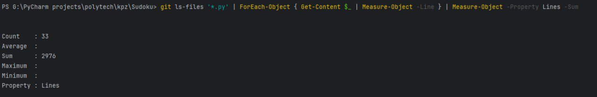
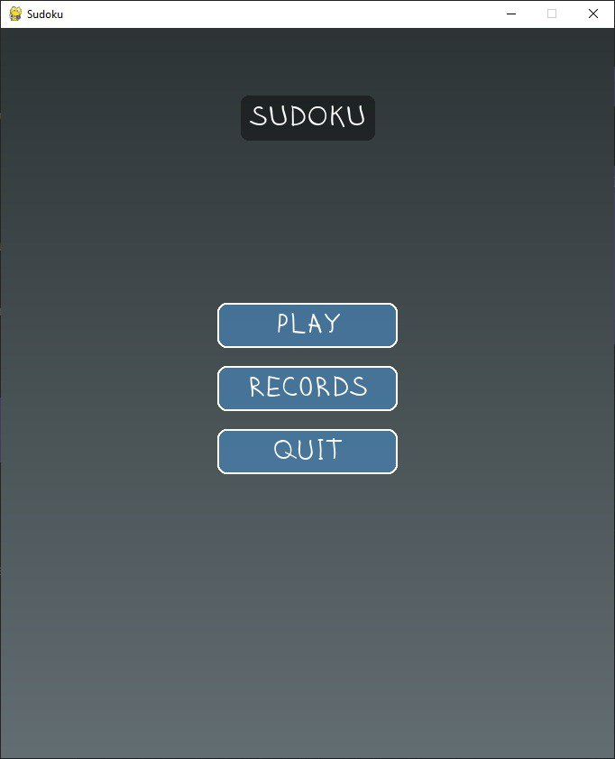
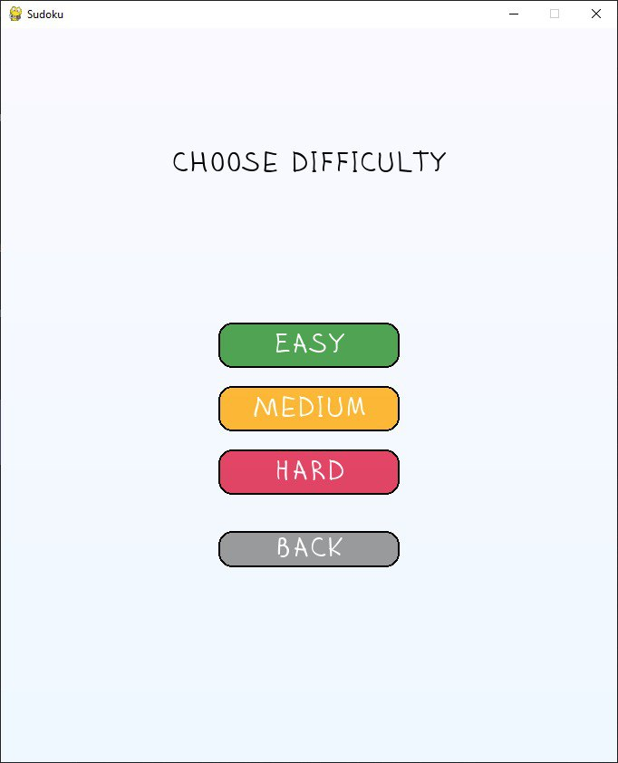
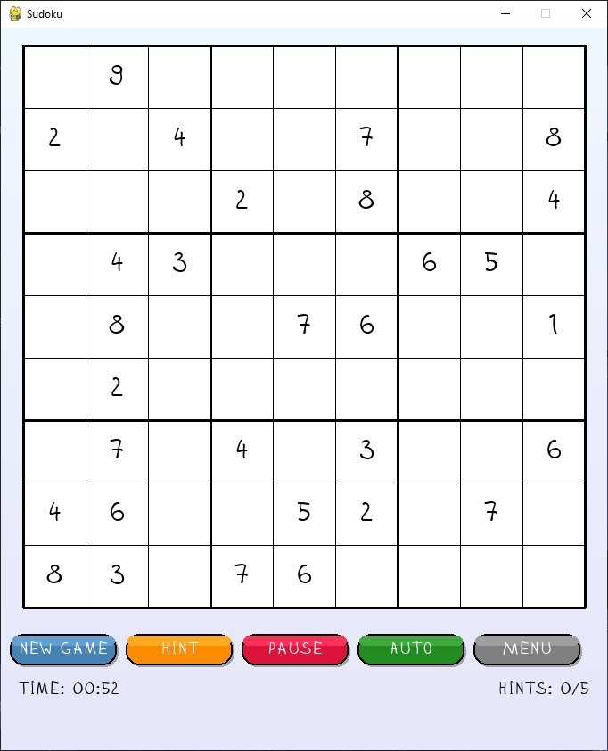
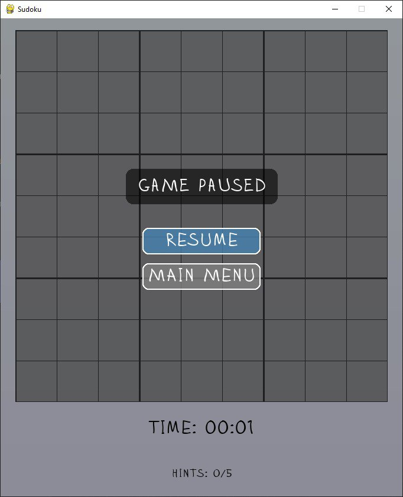
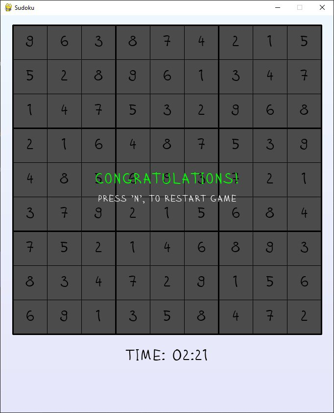
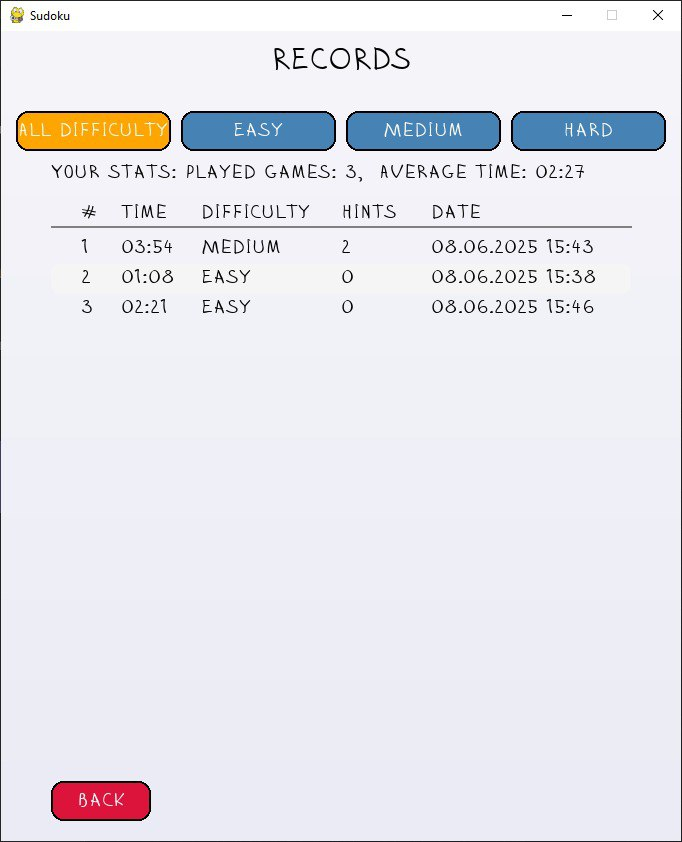
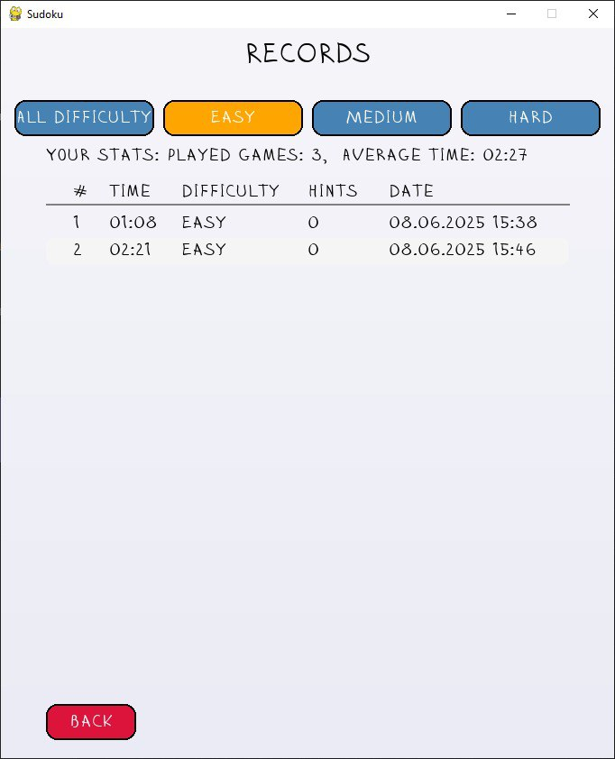

# Sudoku Desktop Application

Комплексна реалізація класичної головоломки Sudoku для настільних систем, побудована з використанням Python та Pygame. Додаток включає повноцінний ігровий движок з автоматичною генерацією завдань, системою перевірки правильності, механізмом допомоги, відліком часу та збереженням досягнень через SQLite базу даних.

## Ключовий функціонал

**Варіативність складності завдань**  
Система підтримує три категорії складності, що дозволяє адаптувати гру під різний рівень майстерності: початковий, проміжний та експертний.

**Динамічне управління етапами гри**  
Реалізовано механізм переходів між основними фазами: стартове меню, активний геймплей, призупинення та фінальний екран.

**Інтелектуальна система допомоги**  
Вбудований алгоритм надання підказок з детальною аналітикою використання для моніторингу залежності від допомоги.

**Комплексна аналітика продуктивності**  
Система фіксує тривалість розв'язання головоломок та веде детальну статистику індивідуального прогресу.

**Персистентне зберігання даних**  
Використання SQLite забезпечує надійне збереження всіх користувацьких досягнень та конфігурацій.

**Архітектурна модульність**  
Код організовано за принципом розділення відповідальностей з ізоляцією бізнес-логіки, інтерфейсу та роботи з даними.

## Організація файлової структури

**[`sudoku/core/`](sudoku/core/)**  
Містить фундаментальну логіку: алгоритми створення головоломок, механізми верифікації та керування станом ігрового поля.

**[`sudoku/game/`](sudoku/game/)**  
Центральний компонент ігрового процесу з реалізацією машини станів та системи хронометражу.

**[`sudoku/database/`](sudoku/database/)**  
Модуль відповідальний за персистентність даних через SQLite з використанням архітектурного патерну Repository.

**[`sudoku/ui/`](sudoku/ui/)**  
Збірка компонентів користувацького інтерфейсу включаючи рендерер на базі Pygame та систему інтерактивних елементів.

**[`sudoku/models/`](sudoku/models/)**  
Визначення структур даних для представлення ігрових сутностей та параметрів складності.

**[`sudoku/utils/`](sudoku/utils/)**  
Колекція допоміжних утиліт для роботи з координатами, форматування тимчасових значень та загальних операцій.

**[`sudoku/config.py`](sudoku/config.py)**  
Централізовані налаштування та константи для використання в усьому проекті.

## Система збереження даних

Всі ігрові результати та статистичні дані автоматично зберігаються у локальній SQLite базі даних з ім'ям `sudoku.db`

Мануальне налаштування системи зберігання не вимагається.

## Детальний опис можливостей

### Основний ігровий режим
Традиційний Sudoku геймплей з підтримкою трьох градацій складності: базовий, стандартний та підвищений рівень  
Система автоматично генерує унікальні головоломки з гарантованою можливістю розв'язання

### Графічна оболонка
Повнофункціональний десктопний інтерфейс що включає:
- Інтерактивну сітку з можливістю введення значень
- Візуальну індикацію вибраних елементів
- Автоматичне виявлення та підсвічування помилок
- Елементи управління з інтуїтивним дизайном

### Алгоритмічна основа
Повна реалізація правил Sudoku з автоматичною перевіркою коректності  
Система визначення завершеності гри та інтелектуальний механізм підказок  
Функція автоматичного визначення потенційних варіантів для кожної комірки

### Система обліку результатів
Фіксація наступних параметрів:
- Час, витрачений на розв'язання
- Обраний рівень складності
- Статистика використання підказок
- Індивідуальні показники гравця
Реалізація через SQLite з можливістю перегляду рейтингових таблиць

### Машина станів
Організація переходів між різними режимами:
- Стартовий екран
- Вибір параметрів складності
- Активна фаза гри
- Режим призупинення
- Екран завершення
- Перегляд статистики та рекордів
Забезпечення стабільної роботи без критичних помилок

### Ергономіка користувацького досвіду
Продуманий інтерфейс з наступними елементами:
- Постійне відображення часу
- Індикатор кількості використаних підказок
- Можливість призупинення процесу
- Підтримка швидких клавіатурних команд
- Візуальні індикатори поточного стану

### Принципи архітектури
Структурована кодова база з дотриманням:
- Принципу єдиної відповідальності
- Незалежної обробки різних аспектів системи
- Застосування патернів Repository та Factory для забезпечення розширюваності

## Застосовані патерни проектування

Архітектура проекту базується на декількох фундаментальних патернах для забезпечення гнучкості, підтримуваності та можливості розширення:

### Патерн Стратегія
**Область застосування**: ISudokuGenerator інтерфейс та SudokuGenerator клас  
**Призначення**: Забезпечує можливість заміни алгоритмів генерації без впливу на клієнтський код  
**Деталі реалізації**: SudokuGenerator використовує backtracking алгоритм через ISudokuGenerator інтерфейс, що дозволяє інтегрувати альтернативні алгоритми без модифікації існуючої логіки

### Патерн Репозиторій
**Область застосування**: IGameRecordRepository, ISavedGameRepository, IUserSettingsRepository та відповідні SQLite імплементації  
**Призначення**: Створює абстрактний рівень для роботи з даними та забезпечує універсальний інтерфейс взаємодії  
**Деталі реалізації**: Кожен репозиторій містить контрактний інтерфейс та конкретну реалізацію, що дозволяє легко змінювати способи зберігання даних

### Патерн Стан
**Область застосування**: IGameState, MainMenuState, PlayingState, PausedState, GameOverState  
**Призначення**: Дозволяє об'єкту динамічно змінювати поведінку залежно від внутрішнього стану  
**Деталі реалізації**: Кожен стан інкапсулює специфічну логіку обробки подій, оновлення та відображення, спрощуючи управління життєвим циклом

### Фабричний метод
**Область застосування**: SudokuGenerator для створення головоломок різних рівнів складності  
**Призначення**: Абстрагує процес створення об'єктів від специфічних деталей інстанціювання  
**Деталі реалізації**: Метод generate приймає параметр Difficulty та повертає відповідну конфігурацію, приховуючи деталі створення

### Патерн Фасад
**Область застосування**: GameDatabaseManager клас  
**Призначення**: Спрощує взаємодію зі складною підсистемою управління даними  
**Деталі реалізації**: GameDatabaseManager координує роботу різних репозиторіїв та сервісів, надаючи єдиний інтерфейс для основного Game класу

## Фундаментальні принципи розробки

Кодова база дотримується основних принципів якісної розробки програмного забезпечення:

### SOLID принципи
**Принцип єдиної відповідальності**: Кожен компонент має чітко визначену область відповідальності  
**Принцип відкритості/закритості**: Компоненти відкриті для розширення через інтерфейси, але захищені від модифікації  
**Принцип підстановки Лісков**: Реалізації інтерфейсів можуть заміняти базові типи без порушення функціональності  
**Принцип розділення інтерфейсів**: Інтерфейси сфокусовані на специфічних аспектах функціональності  
**Принцип інверсії залежностей**: Високорівневі модулі залежать від абстракцій, а не конкретних реалізацій

### Принцип DRY
Уникнення дублювання коду через централізацію спільної логіки та використання відповідних патернів

### Принцип KISS
Підтримка простоти дизайну з чіткими обов'язками компонентів та мінімальною складністю

### Принцип YAGNI
Реалізація тільки необхідної функціональності без передчасного ускладнення системи

## Методи покращення коду

Проект демонструє застосування різних технік рефакторингу для підвищення якості коду:

### Виділення класів
**Приклади**: GameDatabaseManager, GameTimer, ButtonManager, SudokuRenderer  
**Мета**: Зменшення складності через виділення пов'язаної функціональності у окремі компоненти  
**Результат**: ButtonManager відокремлений для управління UI елементами, GameTimer ізольований для роботи з часом

### Виділення методів
**Приклади**: get_hint, auto_notes у SudokuBoard; _load_user_settings, _get_preferred_difficulty у Game  
**Мета**: Декомпозиція складних методів на логічні блоки з можливістю повторного використання  
**Результат**: _load_user_settings інкапсулює логіку завантаження налаштувань під час ініціалізації

### Заміна умовних конструкцій поліморфізмом
**Приклади**: Реалізація State патерну замість розгалужених умовних конструкцій  
**Мета**: Усунення складної умовної логіки через використання поліморфних можливостей  
**Результат**: Кожен стан містить специфічні методи handle_event, update, render

### Введення об'єктів параметрів
**Приклади**: Cell клас та Difficulty енумерація  
**Мета**: Спрощення сигнатур методів через групування пов'язаних параметрів  
**Результат**: Cell об'єднує всі властивості комірки, спрощуючи передачу даних

### Заміна магічних значень константами
**Приклади**: GRID_SIZE, SUB_GRID_SIZE, CELL_SIZE, MAX_HINTS у config.py  
**Мета**: Покращення читабельності та підтримуваності через використання іменованих констант  
**Результат**: Використання GRID_SIZE = 9 замість жорстко закодованих значень

### Переміщення методів
**Приклади**: Перенесення валідаційної логіки з SudokuBoard до SudokuValidator  
**Мета**: Покращення когезії через розміщення методів у логічно відповідних місцях  
**Результат**: is_valid_move та is_board_valid знаходяться у SudokuValidator

### Виділення інтерфейсів
**Приклади**: ISudokuGenerator, ISudokuBoard, IGameState, інтерфейси репозиторіїв  
**Мета**: Забезпечення поліморфізму та гнучкості через визначення контрактів  
**Результат**: ISudokuBoard забезпечує універсальний контракт для всіх реалізацій дошки

### Покращення найменувань
**Застосування у всьому проекті**: Для створення самодокументованого коду  
**Мета**: Підвищення читабельності та зрозумілості коду  
**Результат**: Перейменування init на initialize, check_finished на is_complete для кращої семантики

### Метрики коду
**Загальна кількість рядків**

## Візуальна демонстрація

**Головний інтерфейс**:

**Інтерфейс вибору складності**:

**Ігровий процес**:

**Вікно паузи**:

**Екран завершення**:

**Відображення рекордів**:

**Відображення лише рекордів простої складності**:

---